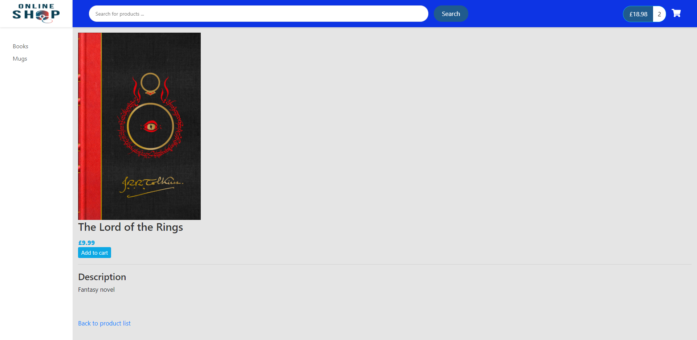

# Onlineshop

This project uses Angular 11.2.8, Spring boot 2.4.4, ng-bootstap, Node and MySQL to build an online shop. 

The shop displays products by category and has a product detail page for each product.

You can search for a product which updates the list of products displayed.

You can use the drop-down at the bottom right of the page to select the number of products you want to list.

You can add products to the cart with the add to cart button.

Pagination has been added to look at the next page of products listed.

You can see the cart status at the top right hand side of the browser which will update as products are added and removed from the cart

The current status includes the number of items and the total.

There is a cart details page where you can increment and decrement items as well as remove them from the cart.

## To run application
To run the application you will need to have Node, npm installed and IntelliJ installed.

You will have to have MySQL installed. Open MySQL workbench and select file menu and then run SQL script. Then run the create-user and database-with-50-products scripts that are in the db folder.

Open the spring-boot-online-shop folder in IntelliJ and open the SpringBootOnlineShopApplication.java file and run it.

Open a console/terminal and navigate to the onlineshop directory inside the frontend folder and run npm install.

When that has finished. At the same location in the console run ng serve --open

This should open your browser `http://localhost:4200/` where you can run the application.

## Screenshots

Page the application opens with

Product detail page

Mugs category page

Cart details page

Products page with pagination set at 10 items. Bottom row cannot be seen in screenshot

Pagination

